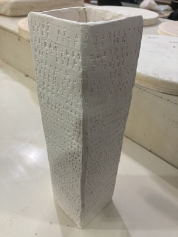

# MUGS
project to transform a client image to a relief map that can be 3d printed and transformed into a mug, bowl, or other item made from slabs!

I take an image or text, wrap it around a mesh, then calculate what needs to be 3d printed. The 3d printed slate is pressed into ceramics to make your design. For a good example, take a look at my _bee movie mug_

## It started with a Bee Movie Mug

I decided it would be neat if I had a mug that had the script of The Bee Movie on it. So, like all good programmers, I decided to find a way we could manufacture it by 3d printing.

Here's the result as greenware after being fired!

Glazed and ready to go

This mug uses an algorithm that wraps a series of text around the side of the hull, avoiding getting too close to any of the edges. 
Since this was my first creation with this algorithm, it looks a bit... rustic. I've recently implemented another algorithm that wraps an arbitrary image
around a hull by using vector paths.

## Current usage
- Current usage is specified in [ProTag](https://github.com/kieda/protag), which is a custom properties language that defines our mesh and image source
- The resulting mesh is put into a slicer and outputs a file compatible with K2 3d printers.

## Future Things
- Build a website so anyone can build a mug and visualize what the result would be in real-time

## High-level algorithm overview
- **Image -> 3d printing**
- User has an image and we wrap it around a mug (virtually)
- We find what the end result of the mug would look like if it had the image carved into the mug
- We find out what we would have to carve into the mug for each face
- We separate out each part that would be carved into the side of the mug
- We find out what we would have to 3d print for each face
- **3d printing -> Mug**
- Roll out a slab of clay (by hand) that would fit the total area of our mug
- Press each component we have 3d printed onto the side of the mug (like a woodcut carving)
- Hand-build the mug by piecing together the neighboring faces of the mug

## Mathy-stuff
Bulk of the work is in `io.hostilerobot.ceramicrelief.texture`. Specifically, the `mesh_traversal` and `projection` packages.
- We provide common algorithms to generate and edit constraint-based hulls (like a sequence of k-cylinders stacked atop one another)
- Vectorize an image into a series of paths that can be wrapped around a hull
  - k-means to identify disjoint regions among the image
  - vectorizer to identify paths along k-means
- Wrap vectorized image around a mesh such that the image is continuous with itself on either side
  - Take an arbitrary mesh (e.g. for a mug, bowl, or something we generated above), and unwrap it such that it's a series of 2d polygons
    - These may be disjoint if hull is not convex, but this is resolved by our graph representation below
    - We traverse the face of the hull following BFS, searching for self-intersections via an RTree
    - Self intersections are stored as separate parts and translated according to a box-packing algorithm
  - 2d polygons for a graph G = (V, E) where vertices are the faces of the mesh, and edges are edges between two mesh faces
  - Vector starts at an arbitrary vertex, and calculates the region of the path according to our orientation and scale. We then walk along neighboring edges.
    - When we encounter a vertex (face) we have previously encountered, we merge the two paths together along the edge using cubic interpolation
- We then have a path that will wrap around an arbitrary mesh given an image. We then calculate the resulting depth of a mesh based on user parameters (Saturation, Value, Etc.)
- The 3d part forms a mesh, which is broken into constituent components for 3d printing

## More Things

Note that these mugs are still excellent to take to your favorite coffee shop

Yeah. It's pretty cool.

